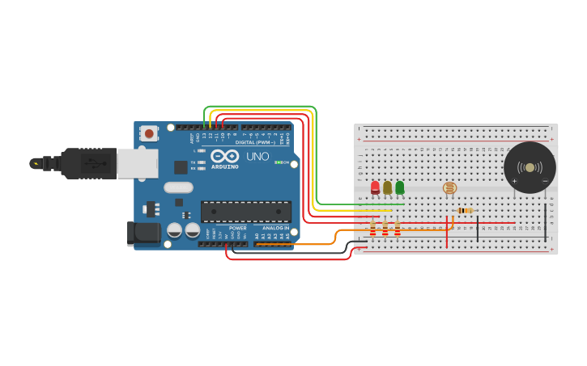

# MONITORAMENTO DE LUMINOSIDADE
### Esse projeto foi feito para monitorar a luminosidade do ambiente e alertar o usuário em caso de condições anormais.

## Índice
- <a href="#descricao">Descrição
</a>

- <a href="#funcionamento">Funcionamento
</a>

- <a href="#tinkercad">Tinkercad
</a>

- <a href="#código">Código
</a>

- <a href="#dependências">Dependências
</a>

- <a href="#reproduzindo">Reproduzindo
</a>

- <a href="#autores">Autores
</a>

## Descrição
O projeto consiste em um monitorador de luminosidade desenvolvido utilizando um fotoresistor, Arduino e LEDs. O objetivo principal é monitorar a luminosidade do ambiente e alertar o usuário em caso de condições fora do esperado.

## Funcionamento
- Tudo correto (Led Verde): Quando a luminosidade está dentro dos parâmetros aceitáveis, o LED verde permanece aceso, indicando que tudo está normal.

- Modo de Alerta (Led Amarelo): Caso a luminosidade detectada esteja abaixo ou acima de determinado limite, o monitorador entra em modo de alerta. Nesse modo, o LED amarelo é ligado e um buzzer é acionado em um ciclo de 3 segundos, indicando ao usuário que a luminosidade está fora do esperado.

- Problema Detectado (Led Vermelho): Se houver um problema crítico, como uma falha no sensor ou outro problema, o monitorador entra em estado de erro. Nesse caso, o LED vermelho é ativado e o buzzer entra em um ciclo de alerta rápido, emitindo um sinal sonoro intermitente a cada 500 milissegundos.

## Tinkercad
- [Abrir projeto no Tinkecad](https://www.tinkercad.com/things/gKPAXbfa8NE-checkpoint-01-edge)



## Código
```
//Declarando Variáveis
int ledR = 11;
int ledY = 12;
int ledG = 13;
int buzzer = 10;
int sensor = A0;
int valorSensor = 0;

//Declarando o tipo da porta
void setup()
{
  pinMode(ledR, OUTPUT);
  pinMode(ledY, OUTPUT);
  pinMode(ledG, OUTPUT);
  pinMode(buzzer, OUTPUT);
  pinMode(sensor, INPUT);
  Serial.begin(9600);
}

void loop() 
{
  valorSensor = analogRead(sensor);//Retornando/lendo o valor lido pela entrada analógica
  Serial.print("Valor =");
  Serial.print(valorSensor);//Mostrando esse valor no monitor serial
  Serial.println("x");
  
  //Criando condições para a ativação dos leds e buzzer
  
  //Estado correto! Sem nenhum problema
  if (valorSensor > 368 and valorSensor < 552) {
    digitalWrite(ledG, HIGH);
    digitalWrite(ledY, LOW);
    digitalWrite(ledR, LOW);
    digitalWrite(buzzer, LOW);
  }
  
  //Estado de alerta! Luminosidade não está de acordo com os parâmetros necessários
  else if (valorSensor > 276 and valorSensor < 644) {
    digitalWrite(ledG, LOW);
    digitalWrite(ledY, HIGH);
    digitalWrite(ledR, LOW);
    digitalWrite(buzzer, LOW);
    delay(3000);
    digitalWrite(buzzer, HIGH);
    delay(3000);
  }
  
  //Estado Crítico! Erro interno ou níveis extremamentos baixos/altos de luminosidade indentificados
  else {
    digitalWrite(ledG, LOW);
    digitalWrite(ledY, LOW);
    digitalWrite(ledR, HIGH);
    digitalWrite(buzzer, LOW);
    delay(500);
    digitalWrite(buzzer, HIGH);
    delay(500);
  }
```

## Dependências
O projeto foi inteiramente feito em linguagem de programação C++ dentro do site Tinkercad.

Para reproduzir este projeto no Tinkercad, você precisará dos seguintes recursos:

### Componentes Virtuais:

- Simulação do Arduino Uno (ou equivalente) disponível no Tinkercad.
- Simulação do fotoresistor.
- LEDs virtuais (verde, amarelo e vermelho).
- Buzzer virtual.
- Resistores virtuais de 220Ohm(3 unidades) e de 10KOhm(1 unidade)
- Protoboard virtual ou área de trabalho para montagem dos componentes.
### Acesso à Plataforma:

- Acesso à internet para usar o Tinkercad.

Certifique-se de ter acesso a esses recursos para poder reproduzir e simular o projeto no ambiente virtual do Tinkercad.

## Reproduzindo
Você pode reproduzir este projeto. Siga estas etapas simples:

- Acesse o Tinkercad e inicie um novo projeto.
Adicione os componentes necessários ao seu circuito virtual, incluindo um Arduino Uno,uma protoboard, três resistores de 220Ohm, um resistor de 10KOhm, um fotoresistor, LEDs (verde, amarelo e vermelho) e um buzzer.
- Conecte os componentes de acordo com o esquema de montagem fornecido neste repositório.
- Abra o código-fonte fornecido neste repositório e copie-o para o editor de código no Tinkercad.
- Compile e carregue o código no Arduino virtual.
- Simule o ambiente de luminosidade variando a luz sobre o fotoresistor.
- Observe as respostas dos LEDs e do buzzer conforme a luminosidade do ambiente.

Com essas etapas, você poderá reproduzir e experimentar o funcionamento do monitorador de luminosidade.

## Referências
Referências utilizadas para estudo e construção do projeto.

Sites:

1. https://www.manualdaeletronica.com.br/ldr-o-que-e-como-funciona/
2. https://www.gta.ufrj.br/grad/01_1/contador555/ldr.htm
3. https://www.blogdarobotica.com/2020/09/29/utilizando-o-sensor-de-luminosidade-ldr-no-arduino/
4. https://embarcados.com.br/arduino-entradas-analogicas/

Vídeos:

1. https://www.youtube.com/watch?v=v-tVI_POC5U
2. https://www.youtube.com/watch?v=7e6uuSfpLdY

## Autores

Este projeto foi desenvolvido por Gabriel Alves Vara.

-> [Linkedin](https://www.linkedin.com/in/gabriel-vara-2406a7275/)